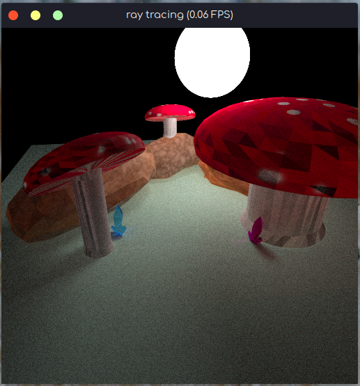
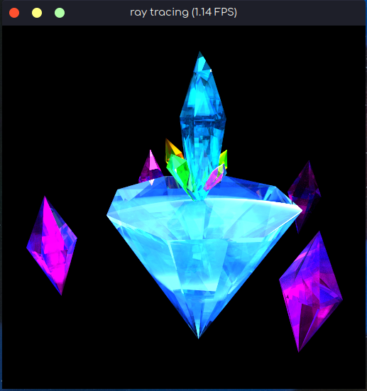

# 【大作业】太极图形课S1-太极光线追踪（扁平kd树实现）

## 成功效果展示

先贴效果图。刚学的 blender， 建模有点粗超，请见谅。因为没有显卡，所以是纯CPU运行（6核 x 3.00GHz）。





## 简介

基于 taichi 编程语言，实现基于扁平kd树的光线追踪。

主要解决的问题：

- [三角形面片与射线相交](#三角形面片) 
- [kd树生成](#kd树生成)
- [分割线的确定](#分割线的确定)
- [扁平化kd树](#扁平化kd树)
- [扁平的遍历](#扁平的遍历)

3D模型:

- 目前只支持 PLY ascii 格式。详见 `plyreader2.py`
- 因为坐标轴问题，贴图要旋转 $-\pi/2$。

## 文件结构

```
- raytrace-c.py (晶体模型的渲染程序)
- raytrace-m.py (蘑菇模型的渲染程序)
- Scene.py (场景，摄像机，光线追踪，...)
- plyread2.py (读取PLY模型)
- view_uv.py (看贴图)
- mesh (模型与贴图的文件夹)
```

运行方式：
- 晶体 `python3 raytrace-c.py`
- 蘑菇 `python3 raytrace-m.py`
- 看贴图 `python3 view_uv.py`

## 符号说明

- 射线： $p = o + t d$. $e$ 为射线的端点， $t$是时间， $d$ 是方向， 在代码中 $\|d\|_F = 1$ 长度固定成 $1$；
- 平面： $n(x - y) = 0$. $n$ 是平面的法向量， $x$ 为平面上的任何一点， $y$ 是另一个点。

## 三角形面片

3D 模型最常用的就是三角形或四边形面片。那么一个核心的问题是如何判断射线与一个三角形面片相交。

一个方法是直接计算。
虎书（Steve Marschner and Peter Shirley. Fundamentals of Computer Graphics 4th ed.）的 4.4.2 有详细讲解。
但这种算法每一次计算相交都要算一个 $3 \times 3$ 的行列式。复杂度比较高。

这里提供另一个思路。
三角形面片是一个二位的物体，射线跟它相交必然先跟三角形所在的平面相交。
我们可以先计算射线与平面相交，然后在看交点是不是在三角形里面。

计算射线$p = o + td$ 到平面 $n(x - (o + td)) = 0$ 相交的时间为 $t = n(x - o) / (nd)$。
如果$t$大于前面最短相交的时间，那么这个三角形不是需要的，可以直接略过。
如果$t$小于前面最短相交的时间,那就判断交点是不是在三角形里面。

对于一个三角形：
```
   a
  / \
 /   \
x --- b
```
有交点坐标 $p$， 参数$\alpha, \beta$ 满足
$$
p = x + \alpha (a-x) + \beta (b-x)
$$

把$x$移到左边，有:
$$
p - x = \alpha (a-x) + \beta (b-x)
$$
为了表示方便，令$\hat{p} = p - x$, $\hat{a} = a - x$, $\hat{b} = b - x$， 展开来就是
$$
\begin{aligned}
    \hat{p}[0] &= \alpha \hat{x}[0] + \beta \hat{b}[0]\\
    \hat{p}[1] &= \alpha \hat{x}[1] + \beta \hat{b}[1]\\
    \hat{p}[2] &= \alpha \hat{x}[2] + \beta \hat{b}[2]\\
\end{aligned}
$$
这里有三条等式，但只有两条的线性独立的（线性代数| 可以大概理解成3式等于1式+2式）。因此求解的时候只需用到两个方程。

那么选那两条方程呢？
我们可以先把他们两两组合，如果能求解的话就求解，如果求不了（如选等式1和等式2，单发现等式1=等式2 乘 某个数），就换一个组合。因为三角形面积不为0， 一定是有一个组合能解的。 

具体来说就是: 判断三个行列式是否为$0$
$$
\begin{aligned}
\det(A_0) &= \left|\begin{matrix}
\hat{a}[1] & \hat{a}[2] \\
\hat{b}[1] & \hat{b}[2] \\
\end{matrix}\right| 
&= \hat{a}[1] ~ \hat{b}[2] - \hat{a}[2] ~ \hat{b}[1] \\
\det(A_1) &= \left|\begin{matrix}
\hat{a}[0] & \hat{a}[2] \\
\hat{b}[0] & \hat{b}[2] \\
\end{matrix}\right| 
&= \hat{a}[0] ~ \hat{b}[2] - \hat{a}[2] ~ \hat{b}[0] \\
\det(A_2) &= \left|\begin{matrix}
\hat{a}[0] & \hat{a}[1] \\
\hat{b}[0] & \hat{b}[1] \\
\end{matrix}\right| 
&= \hat{a}[0] ~ \hat{b}[1] - \hat{a}[1] ~ \hat{b}[0] \\
\end{aligned}
$$

发现三个行列式都与射线无关，所以可以在初始化阶段计算，节省时间。

计算三个行列式后，就可以直接解算 $\alpha,\beta$。

如果 $\det(A_0) \ne 0$, 
$$
\begin{aligned}
    \alpha &= (\hat{p}[0] \hat{a}[1] + \hat{p}[1] \hat{a}[2]) / \det(A_0) \\
    \beta  &= (\hat{p}[0] \hat{b}[1] + \hat{p}[1] \hat{b}[2]) / \det(A_0) \\
\end{aligned}
$$

如果 $\det(A_1) \ne 0$, 
$$
\begin{aligned}
    \alpha &= (\hat{p}[0] \hat{a}[0] + \hat{p}[1] \hat{a}[2]) / \det(A_1) \\
    \beta  &= (\hat{p}[0] \hat{b}[0] + \hat{p}[1] \hat{b}[2]) / \det(A_1) \\
\end{aligned}
$$

如果 $\det(A_2) \ne 0$, 
$$
\begin{aligned}
    \alpha &= (\hat{p}[0] \hat{a}[0] + \hat{p}[1] \hat{a}[1]) / \det(A_2) \\
    \beta  &= (\hat{p}[0] \hat{b}[0] + \hat{p}[1] \hat{b}[1]) / \det(A_2) \\
\end{aligned}
$$

解算出$\alpha, \beta$ 就可以判断点$p$是不是在三角形里面
$$
\alpha > 0;~ \beta > 0;~ \alpha + \beta < 1.
$$

如果是四边形面片，前面的过程相同，判断$\alpha, \beta$时，使用
$$
\alpha > 0;~ \beta > 0;~ \alpha < 1; ~ \beta < 1.
$$

(原理是向量加法)

```
    a
   /
  /---p
 /   /
x---------b
```

这里的 $\alpha, \beta$ 也是定位贴图的依据。

## kd树生成

因为 taichi 既不支持递归又不支持在 `ti.func`里创建动态内存(超级大坑，很多树都用不了)，所以kd树是在Python环境里创建的。

先举一个例子：
比如要在全国范围内找一个人，可以先找他所在的省，然后是市，一级一级往下找。这就比地毯式搜索快很多。

这点在判断相交时也适用。我们可以把物体组成一系列的框，先找一个大框，然后再从大框里找小框，一直找下去。

怎么画框？常见的方法是画分割线，分割线左边的是一个框，右边的是另一个。在中间的就两边都放。

但在找框的时候是要递归或队列的。。。

既没有动态内存又没有递归... 很多常用的方法都用不上 ``/(ㄒ^ㄒ)/```。
在多次试错后，终于找到了一个方法。

根据taichi的特性，计算必须在循环里面完成，那么判断框框的位置关系必须在一次判断就出结果。对于好分离的框框，不用考虑太多。对于重叠的情况
```
|------
|     |
|   --|----
|   | |   |
|---|--   |
    |-----|
```

```
|---------|
|         |
|     ----|
|     |   |
|     ----|
|---------|
```

就不好办了。

那么我们将画3个框：一个是绝对的左边，一个是绝对的右边，还有一个是中间的。然后Python递归就可以创建树了。


## 分割线的确定

分割线要求左边的跟右边的物体数量接近，并且处在中间的物体要少。
根据这个，对于每一个维度，网格搜索（偷懒的做法），找一条分割线使得 $\text{abs}(c_l - c_r) + 0.5 c_m$ 最小， $c_l, c_m, c_r$ 分别为左中右物体数量。

## 扁平化kd树

因为 taichi 的特性。。。这里将前面建好的树压成一维。

数据格式为（前面的数字表示相对偏移量）：
```
# [kdflat]
# 0: corner index; 左下和右上角坐标的位置
# 1: mark; 标志符号
# if mark >= 0: # 偏移量区
#   1: left index; 左树的偏移量
#   2: right index; 右树的偏移量
#   3: mid index; 中间物体偏移量
#   4： lr data index; 左右树物体偏移量
# else: # 数据区
#   2: data len (n); 数据长度
#   3+0: triangle index 0; 三角形的索引。。。
#   3+1: triangle index 1
#   ...: .....
#   3+n-1: triangle index n-1
#
# next block
```


## 扁平的遍历

以 0 偏移节点为根
- 先遍历中间
- 如果只与左边相交：
  - 以左树偏移节点作为根
- 如果只与右边相交
  - 以右树偏移节点作为根
- 都相交
  - 遍历 `lr data index;`
- 循环

只与左右相交很好理解。同时与左右相交就是下图的情况。虽然打到左框，但是射线没有与左框内任何物体相交。因为要一次计算内完成，所以只能把左右物体全遍历。

```
    |------|   |------|
    |   A  |   |      |
-----------------> B  |
    |   A  |   |      |
    |------|   |------|
```

## 致谢

超级感谢太极图形， 天添老师，所有助教们和所有为课程付出的人员！！！