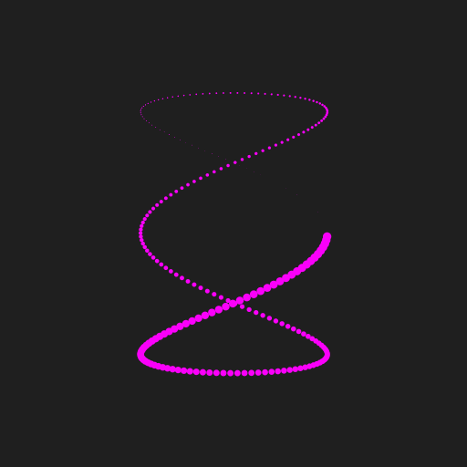
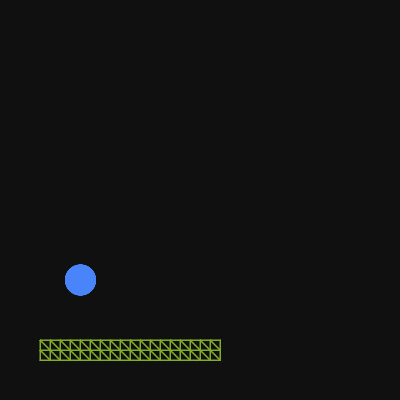

# 太极图形课S1-作业

## Lissajous 

## N-Bodies are bounded (code [Nbodies.py](Nbodies.py))

The size of these particles are equals to their mass.
This word has wall, and when particles hit the wall, they will be reflected.

## Ball Hit Spring

